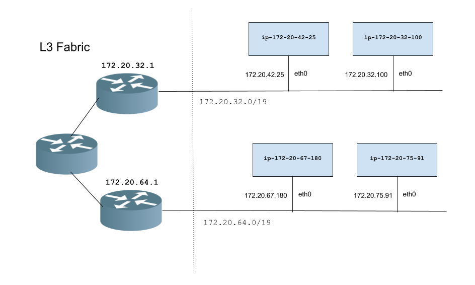
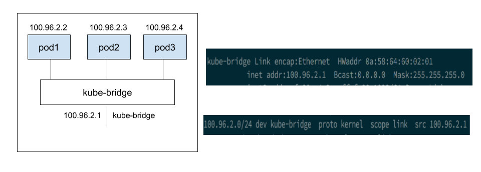

# A day in the life of packet

This document describes the packet flow in the Kubernetes cluster for various scenarios when Kub-router is used as CNI.

## Kubernetes network model

Lets revist the fundamnetal requirements expected by [Kubernetes network model](https://kubernetes.io/docs/concepts/cluster-administration/networking/#kubernetes-model).

* all containers can communicate with all other containers without NAT
* all nodes can communicate with all containers (and vice-versa) without NAT
* the IP that a container sees itself as is the same IP that others see it as 

## An e.g. network topolgy




``` bash
± kubectl get nodes -ao jsonpath='{range .items[*]}{@.status.addresses[?(@.type=="InternalIP")].address}{"     "}{@.spec.podCIDR}{"\n"}{end}' | column -t -s' '
172.20.34.114  100.96.1.0/24
172.20.47.166  100.96.4.0/24
172.20.51.141  100.96.0.0/24
172.20.74.132  100.96.3.0/24
172.20.91.78   100.96.2.0/24
```





```
) k get svc -o wide --all-namespaces
NAMESPACE     NAME           TYPE        CLUSTER-IP       EXTERNAL-IP   PORT(S)         AGE       SELECTOR
default       frontend       NodePort    100.64.153.240   <none>        80:31497/TCP    1h        app=guestbook,tier=frontend
default       kubernetes     ClusterIP   100.64.0.1       <none>        443/TCP         1h        <none>
default       redis-master   ClusterIP   100.66.80.152    <none>        6379/TCP        1h        app=redis,role=master,tier=backend
default       redis-slave    ClusterIP   100.65.21.151    <none>        6379/TCP        1h        app=redis,role=slave,tier=backend
kube-system   kube-dns       ClusterIP   100.64.0.10      <none>        53/UDP,53/TCP   1h        k8s-app=kube-dns
```
```
root@ip-172-20-42-25:/home/admin# ip rule list
0:	from all lookup local
32764:	from 100.96.2.0/24 lookup 77
32765:	from all lookup 79
32766:	from all lookup main
32767:	from all lookup default
root@ip-172-20-42-25:/home/admin# ip route list table 77
172.20.67.180 dev tun-1722067180  scope link
172.20.75.91 dev tun-172207591  scope link
root@ip-172-20-42-25:/home/admin#
root@ip-172-20-67-180:/home/admin# ip rule list
0:	from all lookup local
32764:	from 100.96.3.0/24 lookup 77
32765:	from all lookup 79
32766:	from all lookup main
32767:	from all lookup default
root@ip-172-20-67-180:/home/admin# ip route list table 77
172.20.32.100 dev tun-1722032100  scope link
172.20.42.25 dev tun-172204225  scope link
172.20.49.17 dev tun-172204917  scope link
```
```
root@ip-172-20-42-25:/home/admin# ifconfig kube-dummy-if
kube-dummy-if Link encap:Ethernet  HWaddr fe:f2:10:f2:72:66
          inet addr:100.64.0.1  Bcast:100.64.0.1  Mask:255.255.255.255
          inet6 addr: fe80::fcf2:10ff:fef2:7266/64 Scope:Link
          UP BROADCAST RUNNING NOARP  MTU:1500  Metric:1
          RX packets:0 errors:0 dropped:0 overruns:0 frame:0
          TX packets:3 errors:0 dropped:0 overruns:0 carrier:0
          collisions:0 txqueuelen:0
          RX bytes:0 (0.0 B)  TX bytes:210 (210.0 B)

root@ip-172-20-42-25:/home/admin# ip addr show kube-dummy-if
5: kube-dummy-if: <BROADCAST,NOARP,UP,LOWER_UP> mtu 1500 qdisc noqueue state UNKNOWN group default
    link/ether fe:f2:10:f2:72:66 brd ff:ff:ff:ff:ff:ff
    inet 100.64.0.1/32 brd 100.64.0.1 scope link kube-dummy-if
       valid_lft forever preferred_lft forever
    inet 100.64.0.10/32 brd 100.64.0.10 scope link kube-dummy-if
       valid_lft forever preferred_lft forever
    inet 100.66.80.152/32 brd 100.66.80.152 scope link kube-dummy-if
       valid_lft forever preferred_lft forever
    inet 100.65.21.151/32 brd 100.65.21.151 scope link kube-dummy-if
       valid_lft forever preferred_lft forever
    inet 100.64.153.240/32 brd 100.64.153.240 scope link kube-dummy-if
       valid_lft forever preferred_lft forever
    inet6 fe80::fcf2:10ff:fef2:7266/64 scope link
       valid_lft forever preferred_lft forever
root@ip-172-20-42-25:/home/admin#          
```

```
root@ip-172-20-42-25:/home/admin# ifconfig  kube-bridge
kube-bridge Link encap:Ethernet  HWaddr 0a:58:64:60:02:01
          inet addr:100.96.2.1  Bcast:0.0.0.0  Mask:255.255.255.0
          inet6 addr: fe80::6047:deff:fe2c:41b1/64 Scope:Link
          UP BROADCAST RUNNING MULTICAST  MTU:1500  Metric:1
          RX packets:5694 errors:0 dropped:0 overruns:0 frame:0
          TX packets:5723 errors:0 dropped:0 overruns:0 carrier:0
          collisions:0 txqueuelen:1000
          RX bytes:1227971 (1.1 MiB)  TX bytes:1284096 (1.2 MiB)
root@ip-172-20-42-25:/home/admin# ifconfig eth0
eth0      Link encap:Ethernet  HWaddr 06:fa:8f:18:e3:48
          inet addr:172.20.42.25  Bcast:172.20.63.255  Mask:255.255.224.0
          inet6 addr: fe80::4fa:8fff:fe18:e348/64 Scope:Link
          UP BROADCAST RUNNING MULTICAST  MTU:9001  Metric:1
          RX packets:449038 errors:0 dropped:0 overruns:0 frame:0
          TX packets:49485 errors:0 dropped:0 overruns:0 carrier:0
          collisions:0 txqueuelen:1000
          RX bytes:640606809 (610.9 MiB)  TX bytes:4383676 (4.1 MiB)
root@ip-172-20-42-25:/home/admin# ifconfig tun-172207591
tun-172207591 Link encap:IPIP Tunnel  HWaddr
          UP POINTOPOINT RUNNING NOARP  MTU:8961  Metric:1
          RX packets:10 errors:0 dropped:0 overruns:0 frame:0
          TX packets:10 errors:0 dropped:0 overruns:0 carrier:0
          collisions:0 txqueuelen:1
          RX bytes:840 (840.0 B)  TX bytes:1190 (1.1 KiB)
root@ip-172-20-42-25:/home/admin# ip link show tun-172207591
8: tun-172207591@eth0: <POINTOPOINT,NOARP,UP,LOWER_UP> mtu 8961 qdisc noqueue state UNKNOWN mode DEFAULT group default qlen 1
    link/ipip 172.20.42.25 peer 172.20.75.91          
root@ip-172-20-42-25:/home/admin# ip link show tun-1722067180
9: tun-1722067180@eth0: <POINTOPOINT,NOARP,UP,LOWER_UP> mtu 8961 qdisc noqueue state UNKNOWN mode DEFAULT group default qlen 1
    link/ipip 172.20.42.25 peer 172.20.67.180          
root@ip-172-20-42-25:/home/admin# ifconfig tun-1722067180
tun-1722067180 Link encap:IPIP Tunnel  HWaddr
          UP POINTOPOINT RUNNING NOARP  MTU:8961  Metric:1
          RX packets:0 errors:0 dropped:0 overruns:0 frame:0
          TX packets:0 errors:0 dropped:0 overruns:0 carrier:0
          collisions:0 txqueuelen:1
          RX bytes:0 (0.0 B)  TX bytes:0 (0.0 B)           
```

```
root@ip-172-20-42-25:/home/admin# ip route
default via 172.20.32.1 dev eth0
100.96.0.0/24 via 172.20.49.17 dev eth0  proto 17
100.96.1.0/24 dev tun-172207591  proto 17
100.96.2.0/24 dev kube-bridge  proto kernel  scope link  src 100.96.2.1
100.96.3.0/24 dev tun-1722067180  proto 17
100.96.4.0/24 via 172.20.32.100 dev eth0  proto 17
172.17.0.0/16 dev docker0  proto kernel  scope link  src 172.17.0.1
172.20.32.0/19 dev eth0  proto kernel  scope link  src 172.20.42.25
```

```
root@ip-172-20-32-100:/home/admin# ifconfig kube-bridge
kube-bridge Link encap:Ethernet  HWaddr 0a:58:64:60:04:01
          inet addr:100.96.4.1  Bcast:0.0.0.0  Mask:255.255.255.0
          inet6 addr: fe80::60bb:4bff:fe29:7f8c/64 Scope:Link
          UP BROADCAST RUNNING MULTICAST  MTU:1500  Metric:1
          RX packets:5020 errors:0 dropped:0 overruns:0 frame:0
          TX packets:5007 errors:0 dropped:0 overruns:0 carrier:0
          collisions:0 txqueuelen:1000
          RX bytes:344279 (336.2 KiB)  TX bytes:492141 (480.6 KiB)
root@ip-172-20-32-100:/home/admin# ifconfig eth0
eth0      Link encap:Ethernet  HWaddr 06:ba:00:e0:73:5c
          inet addr:172.20.32.100  Bcast:172.20.63.255  Mask:255.255.224.0
          inet6 addr: fe80::4ba:ff:fee0:735c/64 Scope:Link
          UP BROADCAST RUNNING MULTICAST  MTU:9001  Metric:1
          RX packets:572116 errors:0 dropped:0 overruns:0 frame:0
          TX packets:256945 errors:0 dropped:0 overruns:0 carrier:0
          collisions:0 txqueuelen:1000
          RX bytes:816988565 (779.1 MiB)  TX bytes:18650160 (17.7 MiB)
          
root@ip-172-20-32-100:/home/admin# ifconfig tun-172207591
tun-172207591 Link encap:IPIP Tunnel  HWaddr
          UP POINTOPOINT RUNNING NOARP  MTU:8961  Metric:1
          RX packets:2480 errors:0 dropped:0 overruns:0 frame:0
          TX packets:2478 errors:0 dropped:0 overruns:0 carrier:0
          collisions:0 txqueuelen:1
          RX bytes:211348 (206.3 KiB)  TX bytes:132091 (128.9 KiB)
oot@ip-172-20-32-100:/home/admin# ifconfig tun-1722067180
tun-1722067180 Link encap:IPIP Tunnel  HWaddr
          UP POINTOPOINT RUNNING NOARP  MTU:8961  Metric:1
          RX packets:0 errors:0 dropped:0 overruns:0 frame:0
          TX packets:0 errors:0 dropped:0 overruns:0 carrier:0
          collisions:0 txqueuelen:1
          RX bytes:0 (0.0 B)  TX bytes:0 (0.0 B)                    
root@ip-172-20-32-100:/home/admin# ip link show  tun-172207591
8: tun-172207591@eth0: <POINTOPOINT,NOARP,UP,LOWER_UP> mtu 8961 qdisc noqueue state UNKNOWN mode DEFAULT group default qlen 1
    link/ipip 172.20.32.100 peer 172.20.75.91
root@ip-172-20-32-100:/home/admin# ip link show tun-1722067180
9: tun-1722067180@eth0: <POINTOPOINT,NOARP,UP,LOWER_UP> mtu 8961 qdisc noqueue state UNKNOWN mode DEFAULT group default qlen 1
    link/ipip 172.20.32.100 peer 172.20.67.180
root@ip-172-20-32-100:/home/admin#          
```

```
root@ip-172-20-32-100:/home/admin# ip route
default via 172.20.32.1 dev eth0
100.96.0.0/24 via 172.20.49.17 dev eth0  proto 17
100.96.1.0/24 dev tun-172207591  proto 17
100.96.2.0/24 via 172.20.42.25 dev eth0  proto 17
100.96.3.0/24 dev tun-1722067180  proto 17
100.96.4.0/24 dev kube-bridge  proto kernel  scope link  src 100.96.4.1
172.17.0.0/16 dev docker0  proto kernel  scope link  src 172.17.0.1
172.20.32.0/19 dev eth0  proto kernel  scope link  src 172.20.32.100
root@ip-172-20-32-100:/home/admin#
```

```
root@ip-172-20-67-180:/home/admin# ifconfig eth0
eth0      Link encap:Ethernet  HWaddr 02:31:42:ba:f6:06
          inet addr:172.20.67.180  Bcast:172.20.95.255  Mask:255.255.224.0
          inet6 addr: fe80::31:42ff:feba:f606/64 Scope:Link
          UP BROADCAST RUNNING MULTICAST  MTU:9001  Metric:1
          RX packets:453196 errors:0 dropped:0 overruns:0 frame:0
          TX packets:191423 errors:0 dropped:0 overruns:0 carrier:0
          collisions:0 txqueuelen:1000
          RX bytes:644484735 (614.6 MiB)  TX bytes:14889149 (14.1 MiB)

root@ip-172-20-67-180:/home/admin#

root@ip-172-20-67-180:/home/admin# ifconfig kube-bridge
kube-bridge Link encap:Ethernet  HWaddr 0a:58:64:60:03:01
          inet addr:100.96.3.1  Bcast:0.0.0.0  Mask:255.255.255.0
          inet6 addr: fe80::3c7c:baff:fecf:e60/64 Scope:Link
          UP BROADCAST RUNNING MULTICAST  MTU:1500  Metric:1
          RX packets:8725 errors:0 dropped:0 overruns:0 frame:0
          TX packets:8791 errors:0 dropped:0 overruns:0 carrier:0
          collisions:0 txqueuelen:1000
          RX bytes:1904424 (1.8 MiB)  TX bytes:1958950 (1.8 MiB)
root@ip-172-20-67-180:/home/admin# ifconfig tun-172204225
tun-172204225 Link encap:IPIP Tunnel  HWaddr
          UP POINTOPOINT RUNNING NOARP  MTU:8961  Metric:1
          RX packets:0 errors:0 dropped:0 overruns:0 frame:0
          TX packets:0 errors:0 dropped:0 overruns:0 carrier:0
          collisions:0 txqueuelen:1
          RX bytes:0 (0.0 B)  TX bytes:0 (0.0 B)

root@ip-172-20-67-180:/home/admin# ifconfig tun-1722032100
tun-1722032100 Link encap:IPIP Tunnel  HWaddr
          UP POINTOPOINT RUNNING NOARP  MTU:8961  Metric:1
          RX packets:0 errors:0 dropped:0 overruns:0 frame:0
          TX packets:0 errors:0 dropped:0 overruns:0 carrier:0
          collisions:0 txqueuelen:1
          RX bytes:0 (0.0 B)  TX bytes:0 (0.0 B)

root@ip-172-20-67-180:/home/admin# ip link show tun-172204225
9: tun-172204225@eth0: <POINTOPOINT,NOARP,UP,LOWER_UP> mtu 8961 qdisc noqueue state UNKNOWN mode DEFAULT group default qlen 1
    link/ipip 172.20.67.180 peer 172.20.42.25
root@ip-172-20-67-180:/home/admin# ip link show tun-1722032100
11: tun-1722032100@eth0: <POINTOPOINT,NOARP,UP,LOWER_UP> mtu 8961 qdisc noqueue state UNKNOWN mode DEFAULT group default qlen 1
    link/ipip 172.20.67.180 peer 172.20.32.100
root@ip-172-20-67-180:/home/admin#

root@ip-172-20-67-180:/home/admin# ip route
default via 172.20.64.1 dev eth0
100.96.0.0/24 dev tun-172204917  proto 17
100.96.1.0/24 via 172.20.75.91 dev eth0  proto 17
100.96.2.0/24 dev tun-172204225  proto 17
100.96.3.0/24 dev kube-bridge  proto kernel  scope link  src 100.96.3.1
100.96.4.0/24 dev tun-1722032100  proto 17
172.17.0.0/16 dev docker0  proto kernel  scope link  src 172.17.0.1
172.20.64.0/19 dev eth0  proto kernel  scope link  src 172.20.67.180
root@ip-172-20-67-180:/home/admin#          
```

```
root@ip-172-20-75-91:/home/admin#
root@ip-172-20-75-91:/home/admin# ifconfig eth0
eth0      Link encap:Ethernet  HWaddr 02:84:e9:7d:3d:6e
          inet addr:172.20.75.91  Bcast:172.20.95.255  Mask:255.255.224.0
          inet6 addr: fe80::84:e9ff:fe7d:3d6e/64 Scope:Link
          UP BROADCAST RUNNING MULTICAST  MTU:9001  Metric:1
          RX packets:478921 errors:0 dropped:0 overruns:0 frame:0
          TX packets:203153 errors:0 dropped:0 overruns:0 carrier:0
          collisions:0 txqueuelen:1000
          RX bytes:673934634 (642.7 MiB)  TX bytes:15169453 (14.4 MiB)

root@ip-172-20-75-91:/home/admin# ifconfig kube-bridge
kube-bridge Link encap:Ethernet  HWaddr 0a:58:64:60:01:01
          inet addr:100.96.1.1  Bcast:0.0.0.0  Mask:255.255.255.0
          inet6 addr: fe80::3c14:92ff:fea0:1e18/64 Scope:Link
          UP BROADCAST RUNNING MULTICAST  MTU:1500  Metric:1
          RX packets:6750 errors:0 dropped:0 overruns:0 frame:0
          TX packets:7345 errors:0 dropped:0 overruns:0 carrier:0
          collisions:0 txqueuelen:1000
          RX bytes:515092 (503.0 KiB)  TX bytes:4789354 (4.5 MiB)

root@ip-172-20-75-91:/home/admin# ifconfig  tun-172204225
tun-172204225 Link encap:IPIP Tunnel  HWaddr
          UP POINTOPOINT RUNNING NOARP  MTU:8961  Metric:1
          RX packets:10 errors:0 dropped:0 overruns:0 frame:0
          TX packets:10 errors:0 dropped:0 overruns:0 carrier:0
          collisions:0 txqueuelen:1
          RX bytes:1190 (1.1 KiB)  TX bytes:840 (840.0 B)

root@ip-172-20-75-91:/home/admin# ifconfig tun-1722032100
tun-1722032100 Link encap:IPIP Tunnel  HWaddr
          UP POINTOPOINT RUNNING NOARP  MTU:8961  Metric:1
          RX packets:3113 errors:0 dropped:0 overruns:0 frame:0
          TX packets:3115 errors:0 dropped:0 overruns:0 carrier:0
          collisions:0 txqueuelen:1
          RX bytes:165923 (162.0 KiB)  TX bytes:265717 (259.4 KiB)

root@ip-172-20-75-91:/home/admin# ip link show tun-172204225
9: tun-172204225@eth0: <POINTOPOINT,NOARP,UP,LOWER_UP> mtu 8961 qdisc noqueue state UNKNOWN mode DEFAULT group default qlen 1
    link/ipip 172.20.75.91 peer 172.20.42.25

root@ip-172-20-75-91:/home/admin# ip link show tun-1722032100
11: tun-1722032100@eth0: <POINTOPOINT,NOARP,UP,LOWER_UP> mtu 8961 qdisc noqueue state UNKNOWN mode DEFAULT group default qlen 1
    link/ipip 172.20.75.91 peer 172.20.32.100              
```